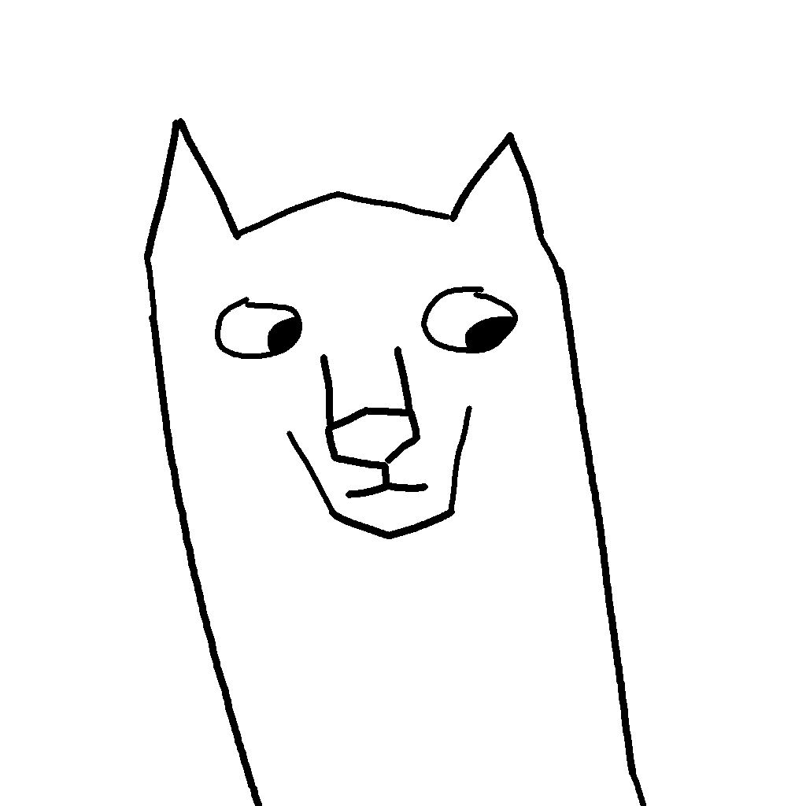

# Wolf Programming Language
A simple, expressive statically typed language made in Rust

## Build requirements
* Rust

## Status
For status on the project, follow the [trello board](https://trello.com/b/pZA9loFU/wolf)